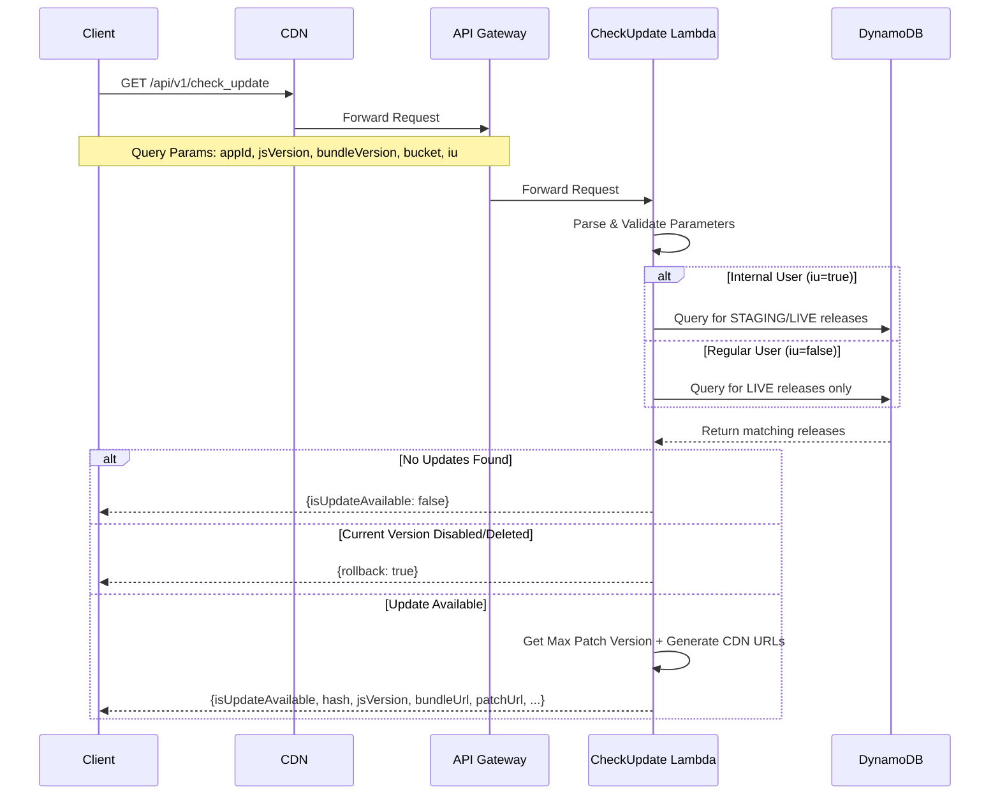

<div align="center">

<p align="center">
  <picture>
    
  </picture>
</p>

### **Ship the change. Not the bundle.**

### The next generation of runtime updates for React Native.

---

**delta** is a production-ready **patch-based runtime update platform** for React Native that enables you to ship bug fixes, performance improvements, and new features instantly—without waiting for App Store or Play Store approvals.

Unlike traditional OTA solutions that download and replace the entire JavaScript bundle, **delta generates and applies lightweight binary patches**, delivering **only what changed**. The result is dramatically smaller downloads, faster update adoption, lower bandwidth consumption, and a seamless update experience for your users.

<br/>


</div>

---

## Why delta?

Traditional OTA platforms replace the **entire JavaScript bundle** every time you publish an update—even if you've changed only a few lines of code.

Delta takes a fundamentally different approach.

Using intelligent **binary delta patching**, it computes the difference between releases and delivers only the bytes required to transform one version into another. This significantly reduces update sizes, accelerates deployments, and helps users stay on the latest version with minimal data usage.

## What does the Server do?

Delta Server is the orchestration engine that powers the entire runtime update lifecycle for your React Native applications.

* 📦 **Manage Releases** by storing and organizing application bundles, assets, and delta patches.
* Δ **Generate & Serve Binary Patches** so devices download only the differences between versions.
* 🚀 **Distribute Runtime Updates** securely to millions of devices with efficient patch delivery.
* 🎯 **Target Specific App Versions** and deployment channels to ensure users receive compatible updates.
* 🔄 **Control Rollouts & Rollbacks** with staged deployments and instant recovery from failed releases.
* 📊 **Track Deployment Metadata** including releases, deployments, patch versions, rollout status, and update history.

Designed to be self-hosted and production-ready, Delta Server gives engineering teams complete ownership and control over their React Native runtime update infrastructure.

> **Ship only the difference. Deliver updates that users barely notice—but always appreciate.**

## Related Repositories

This server is one part of the Delta platform. It works alongside:

| Repository | Description |
|------------|-------------|
| [delta-cli](https://github.com/zepton-labs/delta-cli) | CLI for registry management, bundle uploads, and release workflows |
| [react-native-delta](https://github.com/zepto-labs/react-native-delta) | React Native client SDK for OTA update checks and bundle delivery |

---

## Table of Contents

- [How It Works](#how-it-works)
- [Architecture](#architecture)
- [Prerequisites](#prerequisites)
- [Configuration](#configuration)
  - [template.yaml](#templateyaml)
  - [samconfig.toml](#samconfigtoml)
- [Deployment](#deployment)
  - [Phase 1 — Initial Deploy](#phase-1--initial-deploy)
  - [Phase 2 — Wire Up CloudFront](#phase-2--wire-up-cloudfront)
  - [Phase 3 — Client Config (`delta.config.json`)](#phase-3--client-config-deltaconfigjson)
- [API Reference](#api-reference)
  - [GET /api/v1/check_update](#get-apiv1check_update)
  - [Lambda Functions](#lambda-functions)
    - [GetReleaseListFunction](#getreleaselistfunction)
    - [PostReleaseCreateFunction](#postreleasecreatefunction)
    - [PostReleaseUpdateFunction](#postreleaseupdatefunction)
    - [GetRegistryListFunction](#getregistrylistfunction)
    - [GetReleaseLatestPatchFunction](#getreleaselatestpatchfunction)
    - [PostRegistryCreateFunction](#postregistrycreatefunction)
    - [PostRegistryUpdateFunction](#postregistryupdatefunction)
    - [InvalidateCacheFunction](#invalidatecachefunction)
- [Data Model](#data-model)
  - [ReleaseVersion Encoding](#releaseversion-encoding)
  - [App Release Schema](#app-release-schema)
- [Release States](#release-states)
- [Running Locally](#running-locally)
  - [Local Setup](#local-setup)
  - [Start the DynamoDB Instance](#start-the-dynamodb-instance)
  - [Load Sample Data](#load-sample-data)
  - [Start the API](#start-the-api)
- [Third-Party Licenses](#third-party-licenses)

---

## How It Works



---

## Architecture

| Component | Role |
|---|---|
| **Lambda** (Node.js 20.x) | TypeScript handlers compiled with webpack |
| **DynamoDB** | Single table storing app registry and all release items |
| **S3** | Stores JS bundles and patch files |
| **CloudFront** | CDN in front of S3 (assets) and API Gateway (API calls) |
| **API Gateway** | Routes HTTP requests to Lambda functions |

---

## Prerequisites

| Requirement | Notes |
|---|---|
| Node.js >= 18 | Runtime for build and local development |
| [AWS SAM CLI](https://docs.aws.amazon.com/serverless-application-model/latest/developerguide/install-sam-cli.html) | Infrastructure-as-code deployment tool |
| AWS CLI | Configured with credentials for your target account |

---

## Configuration

Before deploying, fill in two files: `template.yaml` and `samconfig.toml`.

### template.yaml

Replace every `<YOUR_*>` placeholder in the `Parameters` section:

| Parameter | Variable Name | What to put here | Notes |
|---|---|---|---|
| `ServicePrefix` | `<YOUR_SERVICE_PREFIX>` | Short identifier, e.g. `delta-prod` | Prefix for all Lambda and CloudFront resource names |
| `TableName` | `<YOUR_DYNAMODB_TABLE_NAME>` | DynamoDB table name, e.g. `my_delta_releases` | Must be unique in your account + region |
| `S3BucketName` | `<YOUR_S3_BUCKET_NAME>` | S3 bucket name, e.g. `my-delta-bundles` | **Globally unique** across all AWS accounts |
| `CloudFrontIDS` | `<YOUR_CLOUDFRONT_DISTRIBUTION_ID>` | Distribution ID, e.g. `E1ABCDEFGHIJKL` | **Leave empty on first deploy** |
| `DeltaCloudFrontURL` | `<YOUR_CLOUDFRONT_URL>` | `https://xxxx.cloudfront.net/` | **Leave empty on first deploy** — must include trailing `/` |
| `ENVIRONMENT` | `prod` | `prod`, `staging`, `QA`, or `development` | `development` uses local DynamoDB and skips CloudFront calls |

### samconfig.toml

```toml
version = 0.1
[default.deploy.parameters]
stack_name        = "YOUR_STACK_NAME"    # CloudFormation stack name
resolve_s3        = true
s3_prefix         = "YOUR_STACK_NAME"   # Prefix for SAM artifacts in S3
region            = "YOUR_REGION"        # AWS region
confirm_changeset = true
capabilities      = "CAPABILITY_IAM"
disable_rollback  = false

# On initial deploy — leave CloudFrontIDS and DeltaCloudFrontURL empty:
parameter_overrides = "ENVIRONMENT=\"<YOUR_ENV>\" CloudFrontIDS=\"<YOUR_CLOUDFRONT_ID>\" DeltaCloudFrontURL=\"<YOUR_CLOUDFRONT_URL>\""

# After first deploy — fill in the real values from CloudFormation Outputs:
# parameter_overrides = "ENVIRONMENT=\"prod\" CloudFrontIDS=\"XXXXXXXXXX\" DeltaCloudFrontURL=\"https://zzzzzzz.cloudfront.net/\""
```

---

## Deployment

Because `CloudFrontIDS` and `DeltaCloudFrontURL` only exist after the distribution is created, the first deployment requires **two passes**.

### Phase 1 — Initial Deploy

1. **Install dependencies**

```bash
yarn
```

2. **Fill in `template.yaml`** — replace all `<YOUR_*>` placeholders except `CloudFrontIDS` and `DeltaCloudFrontURL`.

3. **Build**

```bash
yarn build
```

4. **Deploy**

```bash
yarn deployProd
```

> CloudFormation creates the DynamoDB table, S3 bucket, CloudFront distribution, API Gateway, and all Lambda functions.

### Phase 2 — Wire Up CloudFront

5. **Retrieve CloudFront values** from either:
   - Terminal — look for the `Outputs` block at the end of the SAM deploy log
   - AWS Console → **CloudFormation** → your stack → **Outputs** tab

   Copy:
   - `DeltaFrontId` → your `CloudFrontIDS`
   - `DeltaFrontDomainName` → your `DeltaCloudFrontURL`

6. **Update `parameter_overrides`** in `samconfig.toml` with the real values (see the commented line above).

7. **Redeploy**

```bash
yarn deployProd
```

> Lambdas will now use the real CloudFront ID for cache invalidations and return CDN URLs in responses.

### Phase 3 — Client Config (`delta.config.json`)

After every successful `yarn deployProd` run, the deploy script automatically:

1. Queries the CloudFormation stack outputs
2. Prints the config JSON to the terminal
3. Saves it as **`delta.config.json`** in the project root

The file looks like this:

```json
{
  "s3": {
    "bucket": "YOUR_BUCKET",
    "region": "YOUR_REGION"
  },
  "lambda": {
    "region": "YOUR_REGION",
    "getLatestPatch": "YOUR_GET_LATEST_PATCH_FUNCTION",
    "getReleaseList": "YOUR_GET_RELEASE_LIST_FUNCTION",
    "createRelease": "YOUR_CREATE_RELEASE_FUNCTION",
    "updateRelease": "YOUR_UPDATE_RELEASE_FUNCTION",
    "getRegistryList": "YOUR_GET_REGISTRY_LIST_FUNCTION",
    "createRegistry": "YOUR_CREATE_REGISTRY_FUNCTION",
    "invalidateCache": "YOUR_INVALIDATE_CACHE_FUNCTION"
  }
}
```

**Copy this file as-is into your client app** and configure it with the [Delta SDK](https://github.com/zepto-labs/react-native-delta). It contains all the Lambda function names and S3 details the SDK needs to invoke the backend directly. Use the [Delta CLI](https://github.com/zepto-labs/delta-cli) to publish bundles and manage releases against this server.

> `delta.config.json` is auto-generated on every deploy — do not edit it manually and add it to `.gitignore` if you do not want it committed.


## API Reference

### `GET /api/v1/check_update`

The primary client-facing endpoint exposed publicly via API Gateway + CloudFront CDN. Checks whether an OTA update is available for a given app and version.

#### Query Parameters

| Param | Type | Required | Description |
|---|---|---|---|
| `appId` | string | ✅ | Unique app identifier |
| `jsVersion` | number | ✅ | Current JS version on the device |
| `bundleVersion` | number | ✅ | Current bundle/patch version on the device |
| `bucket` | number | ✅ | Rollout bucket value (0–100) |
| `iu` | boolean | ❌ | `true` for internal users — sees STAGING + LIVE releases, ignores rollout % |
| `is` | boolean | ❌ | Reserved for future use — currently unused by the server |

#### Response

```jsonc
// No update available
{ "isUpdateAvailable": false }

// Rollback — current version was disabled or deleted
{ "rollback": true }

// Update available
{
  "isUpdateAvailable": true,
  "isMandatory": true,   // true if ANY release between current and latest is marked mandatory
  "hash": "abc123",
  "jsVersion": 101,
  "bundleVersion": 5,
  "releaseState": 20,
  "patchUrl": "https://cdn.example.com/patch.zip",  // null if no patch available
  "bundleUrl": "https://cdn.example.com/bundle.zip"
}
```

---

### Lambda Functions

The following functions are deployed but have no public API Gateway route — they are invoked directly via the AWS Lambda API/SDK.

> **Access:** Direct invocation requires the caller to have the `lambda:InvokeFunction` IAM permission on the target function. Ensure the invoking role or user has been granted appropriate access.

#### Functions Overview

| Function | Handler | Description |
|---|---|---|
| [`GetReleaseListFunction`](#getreleaselistfunction) | `getReleaseList.handler` | Lists releases with filtering & pagination |
| [`PostReleaseCreateFunction`](#postreleasecreatefunction) | `postCreateRelease.handler` | Creates a new release entry |
| [`PostReleaseUpdateFunction`](#postreleaseupdatefunction) | `postUpdateRelease.handler` | Updates an existing release |
| [`GetRegistryListFunction`](#getregistrylistfunction) | `getRegistry.handler` | Returns the app registry list |
| [`GetReleaseLatestPatchFunction`](#getreleaselatestpatchfunction) | `getReleaseLatestBundle.handler` | Gets the latest bundle/patch for a release |
| [`PostRegistryCreateFunction`](#postregistrycreatefunction) | `postCreateRegistry.handler` | Registers a new app |
| [`PostRegistryUpdateFunction`](#postregistryupdatefunction) | `postUpdateRegistry.handler` | Updates an app registration |
| [`InvalidateCacheFunction`](#invalidatecachefunction) | `postInvalidateCache.handler` | Triggers a CloudFront cache invalidation |

---

### GetReleaseListFunction

`getReleaseList.handler` · Direct invocation

Lists releases for an app with optional filtering and pagination.

#### Payload

| Field | Type | Required | Description |
|---|---|---|---|
| `appId` | string | ✅ | App identifier |
| `jsVersion` | number | ❌ | Filter by JS version |
| `bundleVersion` | number | ❌ | Filter by bundle version |
| `releaseState` | string | ❌ | Comma-separated state values e.g. `10,20` |
| `rollout` | number | ❌ | Filter by exact rollout % |
| `appVersion` | string | ❌ | Filter by native app version |
| `limit` | number | ❌ | Page size (default: 100) |
| `nextKey` | string | ❌ | Pagination cursor from previous response |

#### Response

```jsonc
{
  "releases": [ /* array of App Release Schema in camelCase */ ],
  "count": 10,
  "nextKey": "{...}"  // null if no more pages
}
```

---

### PostReleaseCreateFunction

`postCreateRelease.handler` · Direct invocation

Creates a new release entry. Initial `rollout` is always `0` and `defaultRelease` is always `false`.

#### Payload

| Field | Type | Required | Description |
|---|---|---|---|
| `appId` | string | ✅ | App identifier |
| `jsVersion` | number | ✅ | JS bundle major version (> 0) |
| `bundleVersion` | number | ✅ | Bundle/patch number (>= 0) |
| `hash` | string | ✅ | Bundle integrity hash |
| `bundle` | object | ✅ | `{ url: string }` — S3 URL of the full bundle |
| `patchList` | array | ❌ | `[{ id: string, url: string }]` — patch entries |
| `releaseState` | number | ❌ | Initial state — only `0` (CREATED) or `10` (STAGING). Defaults to `0` |
| `appVersion` | string | ❌ | Native app version constraint |
| `nativeRelease` | boolean | ❌ | Whether this is a native release. Defaults to `false` |
| `isMandatory` | boolean | ❌ | Whether this release is mandatory — clients must apply it immediately. Defaults to `false` |
| `description` | string | ❌ | Release notes |

#### Response

```json
{ "success": true }
```

> Returns `409` if a release with the same `jsVersion` + `bundleVersion` already exists.

---

### PostReleaseUpdateFunction

`postUpdateRelease.handler` · Direct invocation

Updates an existing release. At least one optional field must be provided. Triggers a CloudFront cache invalidation for `check_update`.

#### Payload

| Field | Type | Required | Description |
|---|---|---|---|
| `appId` | string | ✅ | App identifier |
| `jsVersion` | number | ✅ | JS version of the release to update |
| `bundleVersion` | number | ✅ | Bundle version of the release to update |
| `releaseState` | number | ❌ | New state — must follow allowed transitions (see [Release States](#release-states)) |
| `rollout` | number | ❌ | New rollout % (0–100) — can only be **increased** |
| `defaultRelease` | boolean | ❌ | Mark as default — only valid for native releases with no existing default |
| `isMandatory` | boolean | ❌ | Set or clear the mandatory flag for this release |
| `description` | string | ❌ | Updated release notes |

#### Response

```json
{ "success": true }
```

> Returns `404` if the release does not exist. Returns `400` if the state transition is not allowed or rollout would decrease.

---

### GetRegistryListFunction

`getRegistry.handler` · Direct invocation

Returns the complete app registry list. No payload required.

#### Response

```jsonc
{
  "registries": [ /* array of registered app entries */ ]
}
```

---

### GetReleaseLatestPatchFunction

`getReleaseLatestBundle.handler` · Direct invocation

Gets the latest bundle/patch information for a specific release.

#### Payload

| Field | Type | Required | Description |
|---|---|---|---|
| `appId` | string | ✅ | App identifier |
| `jsVersion` | number | ✅ | JS version to query |

---

### PostRegistryCreateFunction

`postCreateRegistry.handler` · Direct invocation

Registers a new app in the system.

#### Payload

| Field | Type | Required | Description |
|---|---|---|---|
| `appId` | string | ✅ | Unique app identifier to register |

#### Response

```json
{ "success": true }
```

---

### PostRegistryUpdateFunction

`postUpdateRegistry.handler` · Direct invocation

Updates an existing app registration entry.

#### Payload

| Field | Type | Required | Description |
|---|---|---|---|
| `appId` | string | ✅ | App identifier to update |

#### Response

```json
{ "success": true }
```

---

### InvalidateCacheFunction

`postInvalidateCache.handler` · Direct invocation

Triggers a CloudFront cache invalidation for the `check_update` endpoint. Useful when you need to force clients to receive fresh responses immediately.

#### Payload

| Field | Type | Required | Description |
|---|---|---|---|
| `appId` | string | ✅ | App identifier to invalidate cache for |

#### Response

```json
{ "success": true }
```

---

## Data Model

All data lives in a single DynamoDB table with partition key `AppId` (String) and sort key `ReleaseVersion` (String).

### ReleaseVersion Encoding

Sort key format: `JJJJ-PP`

| Segment | Description |
|---|---|
| `JJJJ` | JS version, zero-padded to 4 digits |
| `PP` | Bundle/patch number, zero-padded to 2 digits |

**Examples:** `0099-01`, `0101-12`. Registry items use the reserved key `0000-00`.

### App Release Schema

| Field | Type | Description |
|---|---|---|
| `AppId` | string | Unique app identifier |
| `ReleaseVersion` | string | Encoded sort key (`JJJJ-PP`) |
| `JsVersion` | number | JS bundle major version |
| `BundleVersion` | number | Patch/bundle number |
| `ReleaseState` | number | Current state (see below) |
| `Rollout` | number | Rollout percentage (0–100) |
| `Bundle` | object | `{ url: string }` — S3/CDN URL of the full bundle |
| `Hash` | string | Bundle integrity hash |
| `Patches` | object | Map of patch entries keyed by `patch-PP-PP` |
| `AppVersion` | string | Optional native app version constraint |
| `NativeRelease` | boolean | Whether this is a native release |
| `DefaultRelease` | boolean | Whether this is the default release |
| `IsMandatory` | boolean | Whether clients must apply this update immediately (cannot skip) |
| `Description` | string | Release notes |
| `CreatedAt` | string | ISO timestamp |
| `UpdatedAt` | string | ISO timestamp |

---

## Release States

| State | Value | Description | Allowed Transitions |
|---|---|---|---|
| `CREATED` | `0` | Initial state after creation | → STAGING, DISABLED, DELETED |
| `STAGING` | `10` | Visible to internal staging users only | → LIVE, DISABLED, DELETED, HALTED |
| `LIVE` | `20` | Visible to all users (subject to rollout %) | → DISABLED, DELETED, HALTED |
| `HALTED` | `25` | Paused — temporarily stopped while live | → LIVE, DISABLED, DELETED |
| `DISABLED` | `30` | Disabled — triggers client rollback | → DELETED |
| `DELETED` | `40` | Permanently removed — terminal state | — |

---

## Running Locally

### Local Setup

- Install sam cli from [here](https://docs.aws.amazon.com/serverless-application-model/latest/developerguide/install-sam-cli.html)
- Install docker from [here](https://docs.docker.com/desktop/install/mac-install/)
- Install NoSQL Workbench application from [here](https://docs.aws.amazon.com/amazondynamodb/latest/developerguide/workbench.settingup.html)
- Install local dependencies
  ```bash
  yarn
  ```

### Start the DynamoDB Instance

- Open NoSQL Workbench application and start the Local DDB Server by toggling on the switch on bottom left side of the application
- By default it runs on the port 8000. Change `envlocal.json` file with `http://{{your-ip-address}}:8000`

### Load Sample Data

`yarn load-local-data` does the following:

1. **Creates the DynamoDB table** locally if it doesn't already exist (using the schema defined in `src/local/schema.ts`).
2. **Seeds app release records** from `sampleAppReleasesData` in `src/local/sampleData.ts` into the local table.
3. **Seeds app registry records** from `sampleAppRegistryData` in `src/local/sampleData.ts` into the same table.

#### Customising `src/local/sampleData.ts`

The file exports two arrays you can freely edit before running `yarn load-local-data`:

**`sampleAppReleasesData`** — each entry represents a release record:

| Field | Description |
|---|---|
| `AppId` | Your app identifier (e.g. `myAppAndroid`) |
| `ReleaseVersion` | Encoded sort key in `JJJJ-PP` format — e.g. `0099-01` for JS version 99, bundle 1 |
| `JsVersion` | JS bundle major version number |
| `BundleVersion` | Patch/bundle number |
| `Rollout` | Rollout percentage (0–100) |
| `Bundle.url` | Replace `YOUR_SAMPLE_URL` with any placeholder or real S3 URL |
| `Hash` | Bundle integrity hash |
| `Patches` | `null` if no patches, or a map of `{ 'Patch-PP-PP': { url, size? } }` entries |
| `ReleaseState` | `0` = CREATED, `10` = STAGING, `20` = LIVE, `30` = DISABLED |
| `IsMandatory` | `true` if clients must apply this update immediately, `false` otherwise |

**`sampleAppRegistryData`** — each entry registers an app:

| Field | Description |
|---|---|
| `AppId` | Must match the `AppId` used in release records |
| `ReleaseVersion` | Always `0000-00` (reserved key for registry entries) |
| `AppName` | Human-readable app name |
| `Platform` | `iOS` or `android` |
| `IsEnabled` | `true` to enable the app |

- Start the Local DynamoDB instance.
- Run
  ```bash
  yarn load-local-data
  ```

### Start the API

Open Docker Desktop first, then:

```bash
yarn start
```

Server available at `http://localhost:3000`.

---

## Third-Party Licenses

This project depends on the following third-party open-source packages. See each license for terms and conditions.

| Package | Version | License | License Changed? |
|---|---|---|---|
| [@aws-sdk/client-cloudfront](https://www.npmjs.com/package/@aws-sdk/client-cloudfront) | 3.872.0 | [Apache-2.0](https://www.apache.org/licenses/LICENSE-2.0) | No |
| [@aws-sdk/client-dynamodb](https://www.npmjs.com/package/@aws-sdk/client-dynamodb) | 3.872.0 | [Apache-2.0](https://www.apache.org/licenses/LICENSE-2.0) | No |
| [@aws-sdk/client-s3](https://www.npmjs.com/package/@aws-sdk/client-s3) | 3.872.0 | [Apache-2.0](https://www.apache.org/licenses/LICENSE-2.0) | No |
| [@aws-sdk/lib-dynamodb](https://www.npmjs.com/package/@aws-sdk/lib-dynamodb) | 3.872.0 | [Apache-2.0](https://www.apache.org/licenses/LICENSE-2.0) | No |
| [@types/aws-lambda](https://www.npmjs.com/package/@types/aws-lambda) | 8.10.137 | [MIT](https://opensource.org/licenses/MIT) | No |
| [@types/aws-sdk](https://www.npmjs.com/package/@types/aws-sdk) | 2.7.0 | [MIT](https://opensource.org/licenses/MIT) | No |
| [@types/lodash.camelcase](https://www.npmjs.com/package/@types/lodash.camelcase) | 4.3.9 | [MIT](https://opensource.org/licenses/MIT) | No |
| [@types/node](https://www.npmjs.com/package/@types/node) | 20.12.7 | [MIT](https://opensource.org/licenses/MIT) | No |
| [@types/webpack](https://www.npmjs.com/package/@types/webpack) | 5.28.5 | [MIT](https://opensource.org/licenses/MIT) | No |
| [chalk](https://www.npmjs.com/package/chalk) | 4.1.2 | [MIT](https://opensource.org/licenses/MIT) | No |
| [husky](https://www.npmjs.com/package/husky) | 9.0.11 | [MIT](https://opensource.org/licenses/MIT) | No |
| [lint-staged](https://www.npmjs.com/package/lint-staged) | 15.2.2 | [MIT](https://opensource.org/licenses/MIT) | No |
| [lodash.camelcase](https://www.npmjs.com/package/lodash.camelcase) | 4.3.0 | [MIT](https://opensource.org/licenses/MIT) | No |
| [prettier](https://www.npmjs.com/package/prettier) | 3.2.5 | [MIT](https://opensource.org/licenses/MIT) | No |
| [ts-loader](https://www.npmjs.com/package/ts-loader) | 9.5.1 | [MIT](https://opensource.org/licenses/MIT) | No |
| [typescript](https://www.npmjs.com/package/typescript) | 5.4.4 | [Apache-2.0](https://www.apache.org/licenses/LICENSE-2.0) | No |
| [webpack](https://www.npmjs.com/package/webpack) | 5.91.0 | [MIT](https://opensource.org/licenses/MIT) | No |
| [webpack-cli](https://www.npmjs.com/package/webpack-cli) | 5.1.4 | [MIT](https://opensource.org/licenses/MIT) | No |

---

## Credits

- [Kushagra Gupta](https://www.linkedin.com/in/kushagra-gupta-67384ba7/)
- [Amit Mundra](https://www.linkedin.com/in/amit-mundra-17201bba/)
- [Zubin Paul](https://www.linkedin.com/in/zubin-paul)
- [Saiyam Arora](https://www.linkedin.com/in/saiyam-arora-0b5107215/)

### Special Thanks

- [Nikhil Mittal](https://www.linkedin.com/in/nikhilkmittal/)
